# Claude Usage Status Bar

Your **month-to-date Claude Code spend vs. your monthly budget**, in the VS Code status bar. It counts usage across every session and every VS Code window, and **starts again from $0 on the 1st of each month (local time)**. That core has not changed.

Version 0.4 adds an **Orchestration Hub** (every project and session on one spend-first page) and **Plan Handoff** (when Claude presents a plan, VS Code offers to send it to a fresh session, with a suggested model and effort). Version 0.3 added a **context meter**, a **Waste Report**, **per-session and per-feature cost**, and an opt-in **token-saver hooks pack**.


- **Status bar:** `$551 ●●●○○ 55% · ctx 142k`. The pulse icon becomes a warning (yellow) at 75% and an error (red) at 90%. The `ctx 142k` hint appears only when your current session's context gets large.
- **Hub item:** `2 waiting · 4 live` next to it. Click it for the Orchestration Hub.
- **Hover:** spent / budget, remaining, projected month end, safe daily spend, top models, **this session's cost**, and the context size with a concrete saving tip.
- **Click:** a dashboard that follows your VS Code theme (light, dark, high contrast).

| Dark | Light |
|---|---|
| 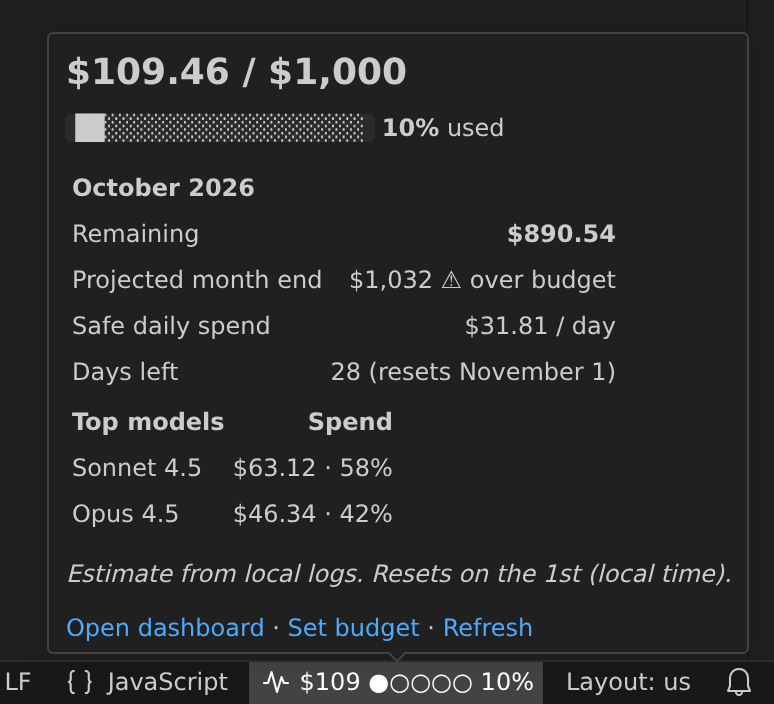 | 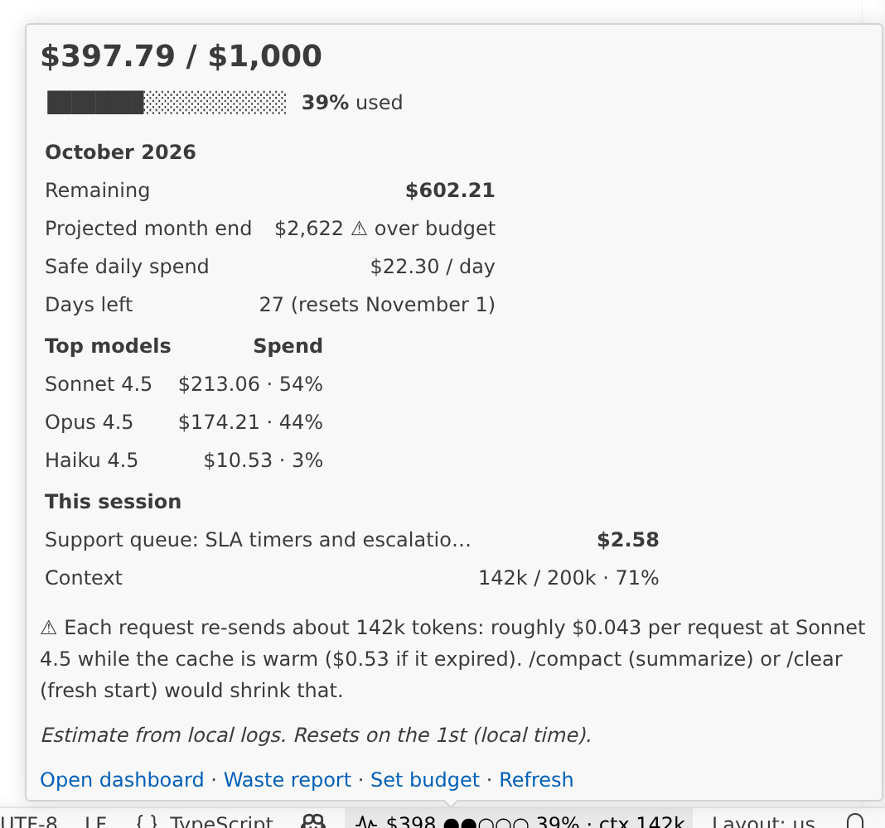 |

## Install from a GitHub release (no marketplace needed)
1. Download `claude-usage-statusbar-0.4.0.vsix` from the repo's **Releases** page (or build it, see [Build / test](#build--test)).
2. Install it:
   ```
   code --install-extension claude-usage-statusbar-0.4.0.vsix
   ```
   Or in VS Code: Extensions panel, `...` menu, **Install from VSIX...**, pick the file.
3. The status bar items appear on the right. Installing a newer `.vsix` the same way upgrades it; your settings and history stay.

Plain Claude Code plus VS Code is all it needs: no account, no API key, no network.

## What is new in 0.4

### 1. Orchestration Hub
Command Palette: **Claude Usage: Open Orchestration Hub**, or click the hub item in the status bar (the original item still opens the dashboard). One themed page with the same strict CSP as the dashboard, across **all** projects and sessions on this machine, spend first:

- **Live now:** every session Claude touched in the last hour, with its state (**waiting on you**, **active**), branch, model, context size, this month's cost and last activity. Waiting sessions are listed first.
- **Projects:** month cost, share of spend, sessions this month, live sessions (and how many wait on you), last activity.
- **Sessions this month**, most expensive first, with **money-burner flags** taken from the Waste Report rules: bloated context, cold-cache restarts, an expensive model on routine work. Each flag shows what it cost and is tagged **heuristic**.
- **Plan handoffs:** the plans saved in this window's folders, with the suggested model and effort and whether you sent or skipped them.
- On every session: **Copy resume command** (copies `claude --resume <session id>` and offers to open a terminal in that session's folder) and **Open folder** (opens the session's working folder in a new VS Code window).

| Dark | Light |
|---|---|
| 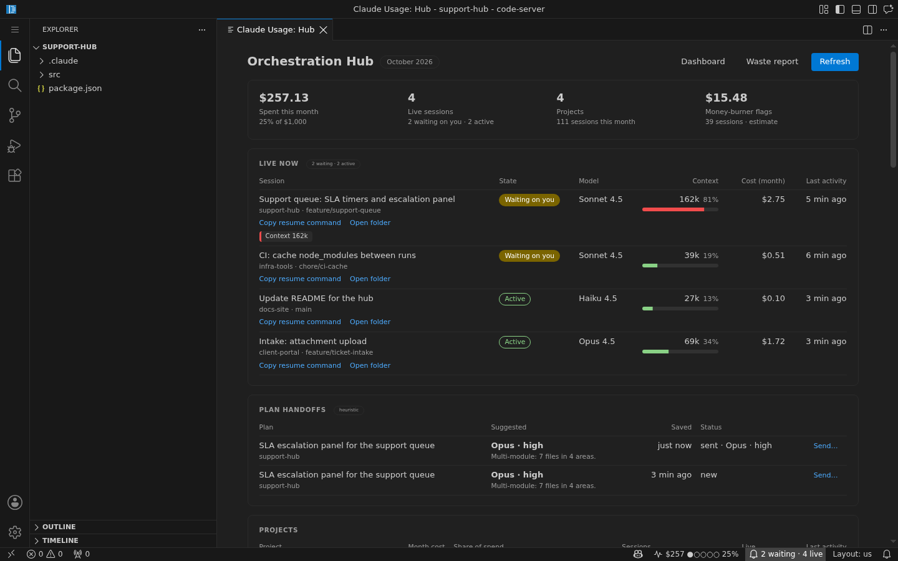 | 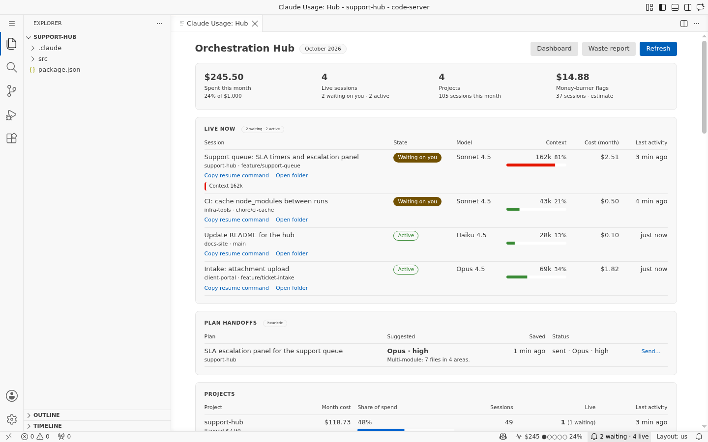 |
| 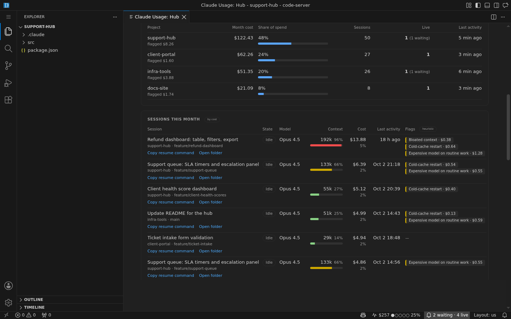 | 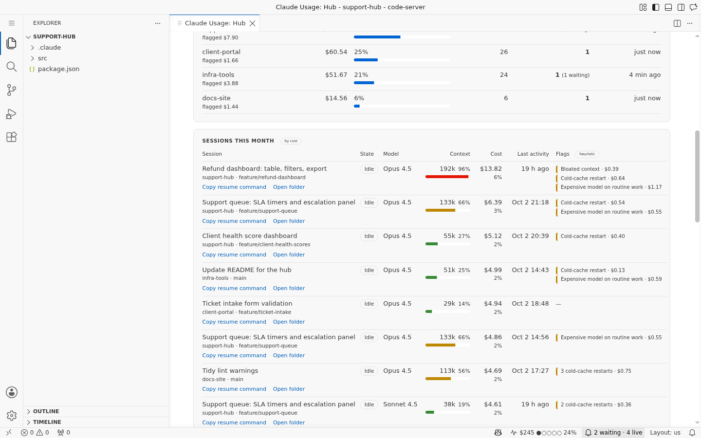 |


How the state is worked out (it is a rule of thumb, so it carries a **heuristic** tag on the page):

| State | Rule |
|---|---|
| Waiting on you | Claude's last message ended its turn (`stop_reason: end_turn`) less than an hour ago, or a tool call has had no result for more than 2 minutes (usually a permission prompt; a very long command looks the same) |
| Active | a prompt or tool result is newer than Claude's last message and less than 10 minutes old, or a tool call is under 2 minutes old |
| Idle | everything else |

The flags use the Waste Report rules below: **Context 162k** when a live session is at or over `contextNudgeAt`, **Bloated context** when a session had requests above it this month, **Cold-cache restart** for rewrites after an idle pause, and **Expensive model on routine work** when the estimated saving on the next cheaper model is at least $0.50.

### 2. Plan Handoff
When you plan in one session, the plan is usually best carried out by a **fresh** one: the planning context (every file Claude read while thinking) is no longer re-sent on each request, and you can pick the model and effort the work really needs.

1. Command Palette: **Claude Usage: Set Up Plan Handoff**. Like the token-saver installer it shows a preview, writes nothing until you confirm, backs up your settings file first, re-checks it before writing, and keeps every other hook (including the token-saver hooks). It installs one opt-in hook, `save-plan.js`, on `PreToolUse` for the `ExitPlanMode` tool.
2. When Claude presents a plan, the hook saves it to `<project>/.claude/handoffs/<yyyymmdd-hhmmss>.md` (and puts a `.gitignore` in that folder so plans are never committed). It never blocks or changes the plan approval in Claude Code.
3. VS Code asks **Send this plan to a new session?** with a suggested model and effort, a one-line reason, and what a fresh session saves compared with re-sending the current context:

| Dark | Light |
|---|---|
| 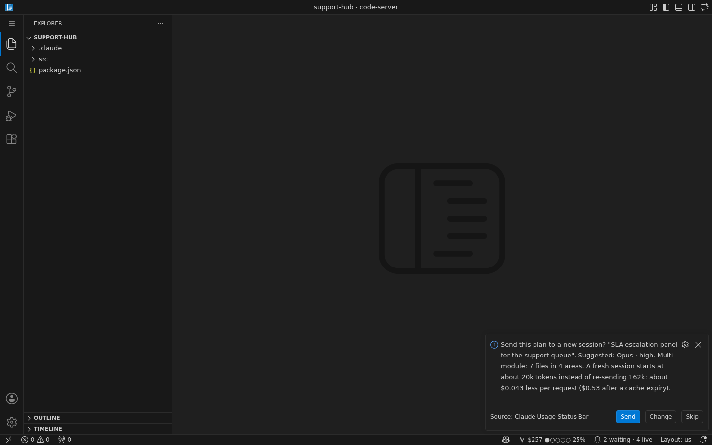 | 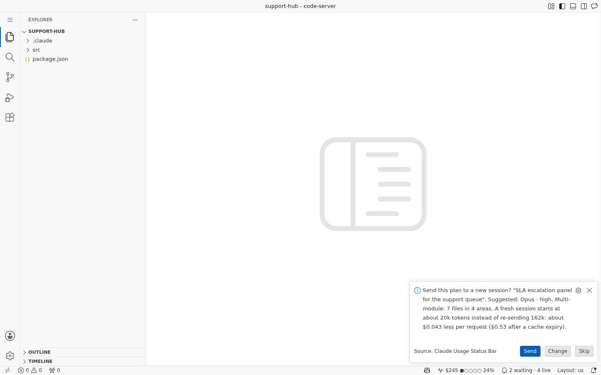 |

- **Send** opens a new terminal in the project folder and runs `claude --model <model> --effort <effort> "@.claude/handoffs/<file>.md Implement this plan. ..."`. The `@` mention makes Claude Code put the whole plan into the first prompt. Stop or reject the plan in the old session yourself; the extension never touches it.
- **Change** lets you pick the model (Opus, Sonnet, or any model name) and the effort (`low`, `medium`, `high`, `xhigh`, `max`); the suggestion is first, so Enter accepts it.
- **Skip** leaves it. Each plan is offered once; **Claude Usage: Send a Plan to a New Session** (or **Send…** in the hub) brings it back later.
- Only plans written by a Claude Code session on this machine (its session id is in your local logs) are offered on their own, and never in an untrusted workspace, so a plan file that arrives with a cloned repo does not pop up. You can still send such a file by hand; the dialog then says that no local session wrote it.

| Send: the new session's command, dark | Light |
|---|---|
| 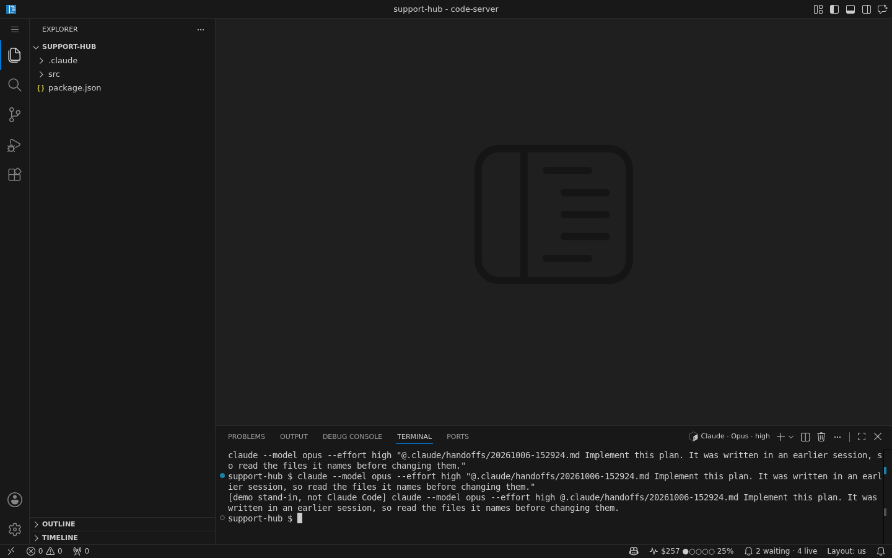 | 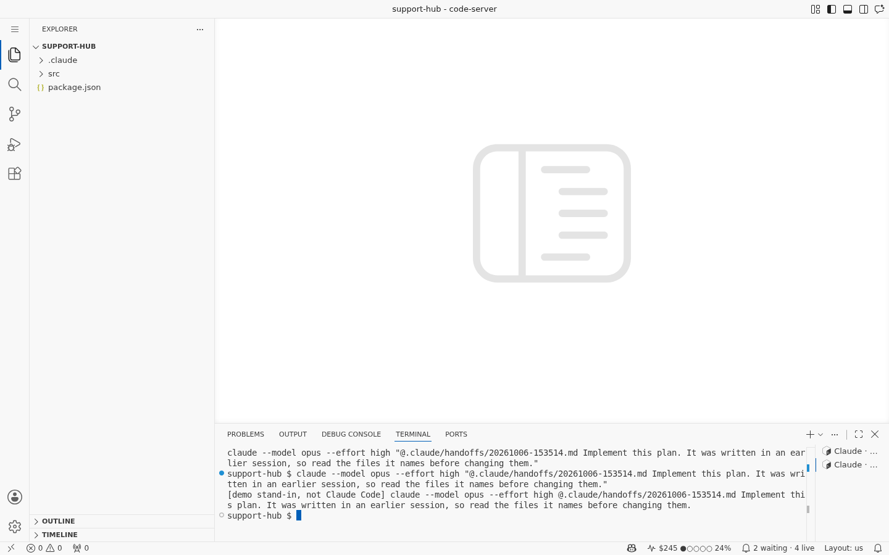 |

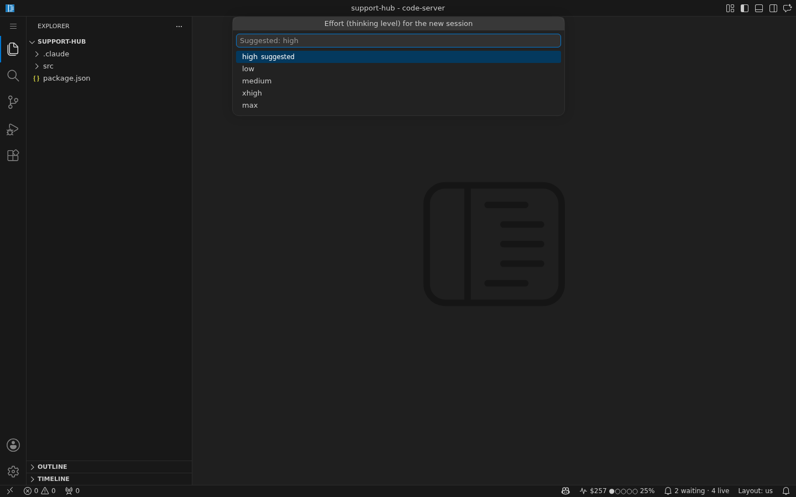

The suggestion is a local, deterministic rule set over the plan's text (no model call, nothing leaves your machine):

| Suggestion | When |
|---|---|
| **Opus · max** | huge or open-ended: over 2,000 words, 20+ files, 6+ areas (top-level folders), 4+ open questions (TBD, unclear, investigate, a line ending in `?`...), or both security and migration keywords |
| **Opus · high** | multi-module or risky: 5+ files, 2+ areas, 10+ steps, over 700 words, or security, migration or refactor keywords |
| **Sonnet · medium** | everything else (routine) |

"Fresh session starts at" = the median first-request context of this project's sessions (system prompt, tools, CLAUDE.md, first prompt) plus the plan itself (characters / 4); without history it assumes 20k. The saving is the difference to the planning session's current context, priced at that session's model's cache-read rate (and cache-write rate after an expiry).

The CLI flags were checked against `claude --help` of Claude Code 2.1.289 (and again on 2.1.291): `--model <model>` ("Provide an alias for the latest model (e.g. 'fable', 'opus', or 'sonnet') or a model's full name") and `--effort <level>` ("Effort level for the current session (low, medium, high, xhigh, max)"). That the `@file` mention in the first prompt puts the file's text into the prompt was checked with a real session (tools disabled, it answered from the file). The hook was checked with a real interactive session in plan mode: the plan was on disk while the approval prompt was still open. Only checked values reach the command line: the model must match a plain name pattern, the effort must be one of the five levels, and the plan file name is the hook's own `yyyymmdd-hhmmss.md`.

## What was new in 0.3

### 1. Context meter
Every request Claude Code makes re-sends the whole conversation. The meter shows how big the current session's context is (`input + cache read + cache write` tokens of its last request) against your model's context window (`claudeUsage.contextWindow`, default 200,000), and says what that costs:

> Each request re-sends about 142k tokens: roughly $0.043 per request at Sonnet 4.5 while the cache is warm ($0.53 if it expired). /compact (summarize) or /clear (fresh start) would shrink that.

You get one notice per session when it passes `claudeUsage.contextNudgeAt` (default 150,000). It is remembered, so it never repeats for the same session, even after a restart. Set it to `0` to turn it off.

### 2. Waste Report
Command Palette: **Claude Usage: Waste Report** (also linked from the hover and the dashboard). A themed page with the same strict CSP as the dashboard:

- **Most expensive sessions** this month, with branch, share of spend, requests and peak context.
- **Cold start vs cache reads:** cost by token class, the cache-write cost of each session's first request, and cache rewrites after idle pauses.
- **Context-bloat sessions:** what re-sending tokens above your threshold cost.
- **Repeated reads** of the same file within a session, and **huge tool results** (over about 5k tokens).
- **Per-model cost share**, and the estimated saving if routine work moved to the next cheaper model.

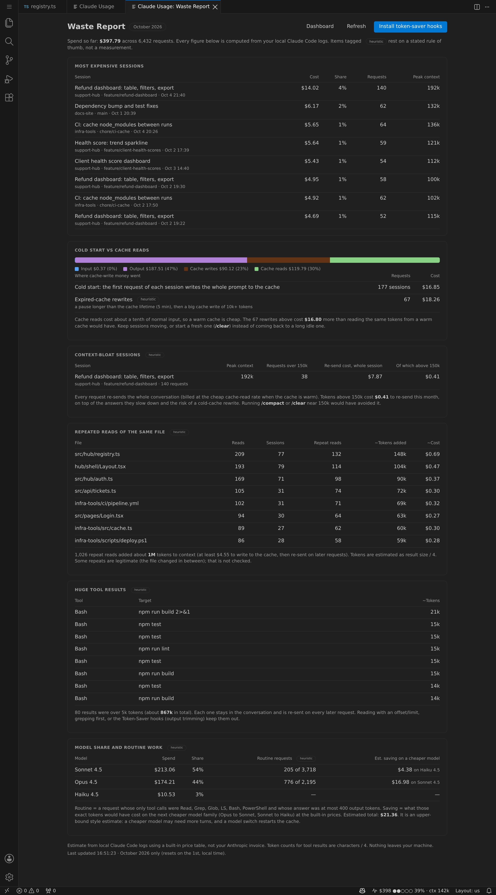
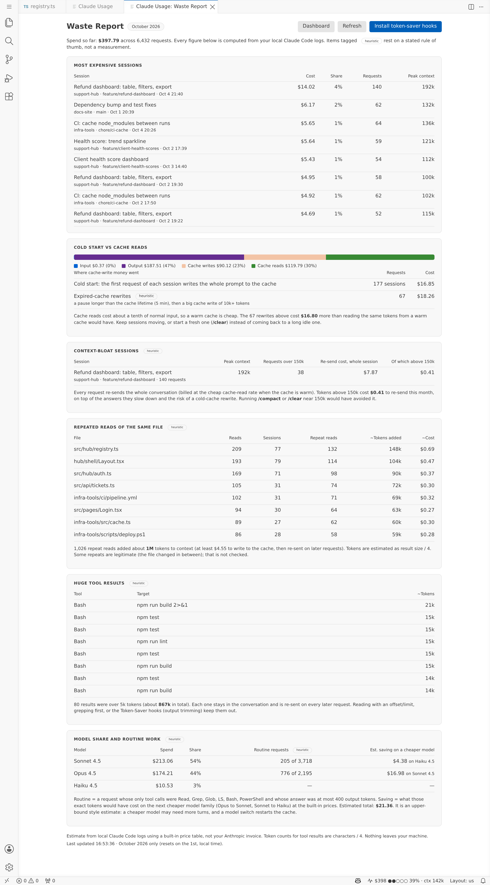

Every number comes from the logs. Where a figure rests on a rule of thumb it carries a **heuristic** tag and says which rule:

| Heuristic | Rule used |
|---|---|
| Expired-cache rewrite | a pause longer than 5 minutes (60 for the 1-hour cache) followed by a cache write of at least 10k tokens; "extra" = that write minus what a warm read would have cost |
| Context bloat | tokens above `contextNudgeAt` in a request, priced at the cache-read rate |
| Repeated read | the same file read again in the same session (not checked for edits in between); tokens = result characters / 4; cost = those tokens at the cache-write rate, a minimum |
| Huge tool result | a single result over 20,000 characters (about 5k tokens by characters / 4) |
| Routine work | a request whose only tool calls were Read, Grep, Glob, LS, Bash or PowerShell and whose answer was at most 400 output tokens; saving = those exact tokens repriced on the next cheaper family (Opus to Sonnet, Sonnet to Haiku). A cheaper model may need more turns and a model switch restarts the cache, so treat it as an upper-bound style estimate |

### 3. Per-session and per-feature cost
The dashboard gets a **Current session** card, a **Recent sessions** list and a **By branch (feature)** breakdown, so you can see what each dashboard or feature cost to build. Work on one git branch is one feature. The month total is still the headline.

| Dark | Light |
|---|---|
| 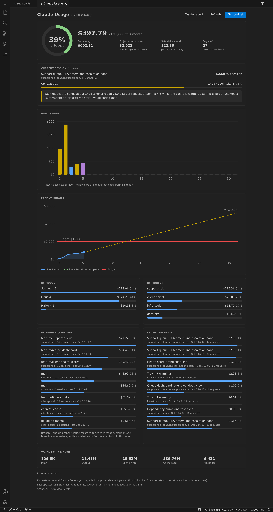 | 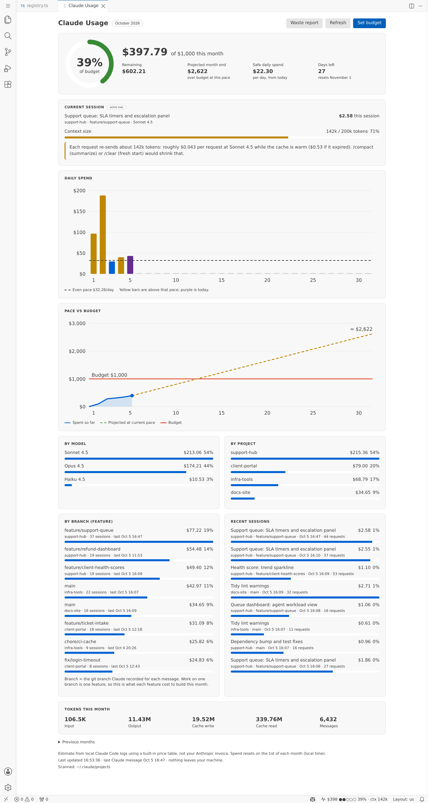 |

### 4. Token-Saver hooks pack (opt-in)
Node-only [Claude Code hooks](hooks/README.md) plus templates, in `hooks/` and `templates/` (both ship in the .vsix):

| What | Where |
|---|---|
| **Read guard**: denies `node_modules`/`dist`/`build`, lockfiles, minified files, binaries and huge files before Claude spends tokens on them | `hooks/guard-reads.js` |
| **Budget guard**: warns you once per session at 75% and 90% of the monthly budget (optional hard stop) | `hooks/budget-guard.js` |
| **Output trimmer**: shortens huge Bash/PowerShell/MCP output before Claude reads it | `hooks/trim-output.js` |
| `settings.json` snippet and a ready-to-copy `permissions.deny` snippet | `hooks/settings.snippet.json`, `hooks/permissions-deny.snippet.json` |
| Starter `CLAUDE.md` for a dashboards hub (architecture, how a dashboard registers, conventions, commands, a "do not read" list) | `templates/CLAUDE.template.md` |
| `/new-dashboard` slash command that scaffolds a dashboard from your pattern | `templates/.claude/commands/new-dashboard.md` |

The templates are generic with `{{PLACEHOLDERS}}` for your own project.

**Install:** Command Palette, **Claude Usage: Install Token-Saver Hooks**. It opens a preview of what it would do, then asks. Nothing is written until you pick an install option and click **Write files** in a confirmation that lists every file. It copies the scripts to `~/.claude/token-saver-hooks`, saves a timestamped backup of your settings file, and merges the hooks in without touching your own hooks and permissions. A settings file that is not valid JSON, or cannot be read, is never touched. If the settings file is edited, created or removed while the confirmation is open, the install aborts without writing anything and you run the command again to review the current settings. Backups never overwrite an earlier backup. "Copy the snippet" options write nothing.

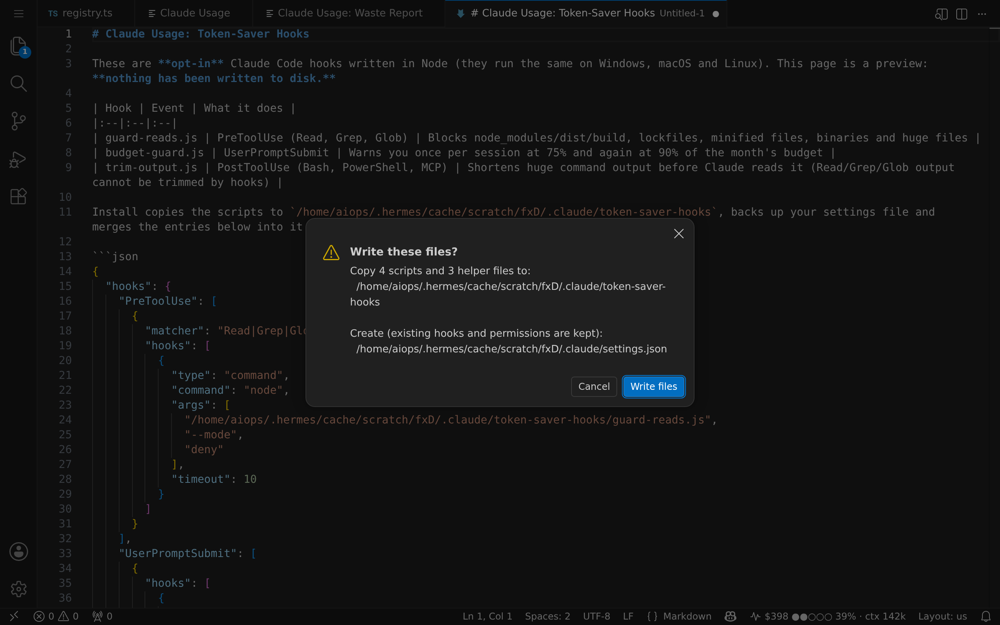

**What hooks can and cannot do** (checked against the [official hooks reference](https://code.claude.com/docs/en/hooks)): they can block or warn before a read, warn you about spend, and replace Bash/PowerShell/MCP output. They **cannot** trim Read/Grep/Glob output (the replacement must match an output shape that is not documented for those tools), cannot stop an `@file` mention from loading a file, cannot switch the model, and are not a hard fence (Claude can still `cat` a file via Bash; use `permissions.deny` for that). Details and the full table are in [hooks/README.md](hooks/README.md). The scripts were also run against a real Claude Code 2.1.289 session to confirm the deny, the context warning and the output trim are accepted.

## Why it is safe to run at work
- **No network access.** No code in the extension or the hook scripts makes a request. They use only `fs`, `os`, `path` and `crypto` (plus the `vscode` API in the extension). The webviews have a strict Content-Security-Policy (`default-src 'none'`): no scripts, no fonts, no remote resources. Charts are inline SVG. A test fails if any runtime file or hook script references a network or process API.
- **Zero runtime dependencies.** Plain JavaScript, no bundler, no `node_modules` in the package. Small enough to audit in a few minutes.
- **Read-only on your Claude logs.** It reads the `.jsonl` transcripts Claude Code already writes under `~/.claude/projects` (plus any `claudeUsage.dataDirs`) and never modifies them. For Plan Handoff it also reads `.claude/handoffs/` in this window's folders, and never changes those files either (which plans were offered is kept in VS Code's own storage). A test fails if any runtime file calls a file-writing API, except the three documented writers: the hooks installer (only after you confirm), the budget guard's small state file, and the opt-in plan hook (it writes only into `<project>/.claude/handoffs/`).
- **Nothing is installed, edited or started silently.** The hooks installer is the only extension code that writes to disk, only after a modal confirmation, with a backup first. The only thing that starts a program is your click on **Send** (new session) or **Open terminal there** (resume): it opens a VS Code terminal and types one `claude ...` command, built only from checked values.
- **No telemetry, no credentials, no API key needed.**

## How it works
Claude Code logs token usage for every message. The extension reads those logs, de-duplicates streamed and resumed messages, prices tokens per model (including 5-minute and 1-hour cache writes and cache reads), and sums the **current calendar month in local time**. Because the numbers come from the log files, they carry across sessions and windows. The 1st of the month needs no action: a timer fires just after local midnight and the periodic refresh re-checks the month, so the status bar rolls over without a restart.

> **Estimate from local logs.** Cost is computed from a built-in price table, not your Anthropic invoice. Check the Anthropic Console for billing-grade numbers. If a model has unknown pricing, Sonnet rates are assumed and a warning shows in the hover. Fix it with `claudeUsage.pricingOverrides`.

### What the logs contain, and how the current session is found
Checked against real Claude Code 2.1 transcripts:
- Every record carries `sessionId`, `cwd`, `gitBranch` and `isSidechain` (true for subagent turns, which share the main session's id). Per-session and per-branch cost use these.
- One assistant message is written as several lines (one per content block) sharing one message id; the last has the final usage. Tool calls are `tool_use` blocks and their results come back as `tool_result` blocks, joined by `tool_use_id`. The Waste Report uses those.
- A resumed or forked session copies earlier messages into a **new file under a new session id**. They are counted once in the totals and stay with the session that wrote them (the copy in the oldest file wins).
- `ai-title` records hold Claude's generated session title, used as the session name.
- `gitBranch` can be `HEAD` (detached or some worktrees); it is shown as "(detached HEAD)".
- Every line of an assistant message carries `stop_reason` (`end_turn` when Claude finished its turn, `tool_use` while a tool call is pending). The hub's waiting / active state uses it together with the time of the newest user line (a prompt or a tool result).

**Assumptions** for "current session": it is the session whose last main-conversation request is newest. With several VS Code windows open, a session whose working folder is one of this window's folders wins. A session counts as **active** if Claude wrote to it in the last hour; the status bar hint and the nudge only apply to an active session, and the hover says "Last session" otherwise. Subagent turns never count toward context size (they have their own), but their cost belongs to the session.

## Convenience
- **First run:** asks you to confirm the monthly budget (default $1,000).
- **Claude Usage: Set Monthly Budget** in the Command Palette (or the link in the hover).
- Updates within a few seconds after Claude Code writes a response (file watcher with throttle), plus a 30 s safety-net rescan, and immediately when you change a setting. Long logs are read incrementally, only the new part.
- One notification at the warning % and one at the critical %, **once per month each**.

## If your IT policy blocks VSIX installs
Copy this repo into `%USERPROFILE%\.vscode\extensions\kimjongjesus.claude-usage-statusbar-0.4.0` and restart VS Code. The hooks and templates are in the installed extension folder (`hooks\`, `templates\`) and in this repo.

## Settings
| Setting | Default | |
|---|---|---|
| `claudeUsage.monthlyBudgetUsd` | `1000` | Monthly budget in USD |
| `claudeUsage.warnAtPercent` / `criticalAtPercent` | `75` / `90` | Yellow / red thresholds (and one-time notices) |
| `claudeUsage.notifyOnThresholds` | `true` | Turn the notices off |
| `claudeUsage.contextWindow` | `200000` | Context window of your model, for the meter (use `1000000` for a 1M model) |
| `claudeUsage.contextNudgeAt` | `150000` | One notice per session at this many tokens of context; `0` = off. Also the hub's context flag |
| `claudeUsage.contextHintAtPercent` | `50` | Show `ctx 142k` in the status bar from this % of the window |
| `claudeUsage.showHubItem` | `true` | Show the hub item (`2 waiting · 4 live`) in the status bar |
| `claudeUsage.planHandoffPrompt` | `true` | Ask "Send this plan to a new session?" when a new plan is saved in this window's folders |
| `claudeUsage.dataDirs` | `[]` | Extra `projects` folders to scan (`~` and `%VAR%` are expanded) |
| `claudeUsage.pricingOverrides` | `{}` | e.g. `{"opus-5": {"input": 5, "output": 25}}` |
| `claudeUsage.refreshSeconds` | `30` | Safety-net rescan interval |

It scans `%USERPROFILE%\.claude\projects` and `%CLAUDE_CONFIG_DIR%\projects`. Path handling is unit-tested with `path.win32`.

**Remote / WSL / dev containers:** logs live on the machine where Claude Code runs, and the extension runs there too. Usage on other machines is not included.

## Build / test
```
npm test                       # unit tests, no dependencies
npx @vscode/vsce package       # builds the .vsix (hooks/ and templates/ are included)
```
Current `vsce` (4.x) needs Node 20 or newer; older `vsce` versions on older Node may need a `globalThis.File` polyfill via `NODE_OPTIONS="--require <file>"`.

`node scripts/make-fixture.js <dir> [--handoff <project-dir>]` writes a fake Claude history (several months, branches, a bloated session, repeated reads, huge tool results, live sessions in every hub state) under `<dir>/.claude/projects`, and with `--handoff` a saved plan like the hook writes. It is not shipped in the .vsix. _All screenshots use this fake data, not real usage._

**Window-resize sweep (optional, dev only).** `node scripts/render-pages.js <fixture-home> <out-dir> [--stress]` writes the dashboard, hub, waste report and hover as static HTML in the light, dark and high-contrast theme variables (`--stress` swaps in very long project and branch names), and `python3 scripts/resize-sweep.py <out-dir>` loads them in headless Chromium at widths from 280 to 1600px, 100/150/200% zoom and short heights, and reports page overflow, off-screen buttons, clipped or overlapping text, tables that break out of their card and unreadably small chart text. It needs the `playwright` Python package and a Chromium; nothing here is part of the extension, the .vsix or `npm test`. The markup and CSS rules the sweep found are pinned by `test/layout.test.js`, which needs no browser.

## Limitations
- Only counts usage logged on this machine. If `~/.claude` is deleted, the current month's number is gone (past-month totals the extension already saw are kept in VS Code's global state for the small "Previous months" list, and are never added to this month).
- Prices are hard-coded estimates and may drift when Anthropic changes them.
- The branch breakdown can only be as good as `gitBranch` in the logs (`HEAD` when detached).
- Waste-report figures marked heuristic are estimates by design; they point at where to look, not at an exact saving.
- Hub states are inferred from the log files: a very long command looks like a permission prompt ("waiting on you"), and a session you closed mid-turn shows as active for up to 10 minutes. A brand-new session appears once Claude has answered once.
- Plan Handoff only offers plans saved in this window's folders (the hook saves into the folder Claude Code was started in), and only plans from the last hour. The model and effort suggestion is a text rule of thumb; **Change** is always one click away.

MIT licensed.
